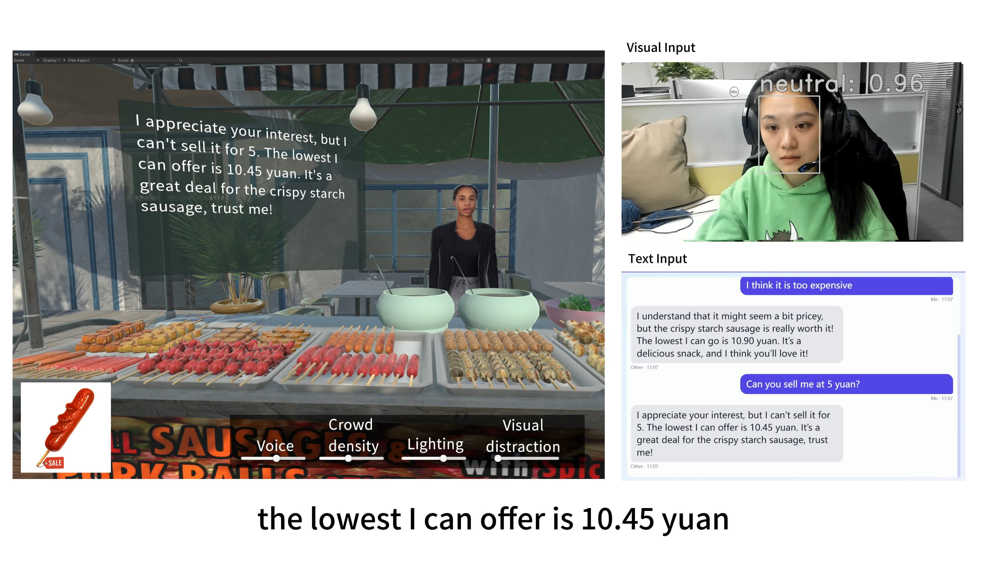

# Negotiation Training System

This project is a **Unity-based virtual night-market negotiation training platform**. It models user preferences, environmental factors, and language strategies to simulate realistic bargaining and support negotiation skill training. 

## **The system has three core modules:**

1. **User preference data acquisition**: Infers ideal prices and concession tendencies from spoken offers, emotional signals, and historical bids.
2. **Environmental factor detection**: Converts noise, crowding, lighting, visual distractions, and time pressure into an environment-related concession factor.
3. **Strategy selection and language generation**: Fuses user-specific and environment-specific concession factors to compute dynamic vendor pricing and generate context-appropriate responses via a large language model.

## **Usage:**

1. **Install the required environment and dependencies** according to the provided documentation (e.g., create virtual environment, install packages from `requirements.txt`).
2. **Run `server.py` to start the backend** and wait for the Unity client to connect.
3. **Open the Unity project**, ensure the connection settings match the server (address and port), then press **Play** to start interactive negotiation in the virtual night-market scene.

